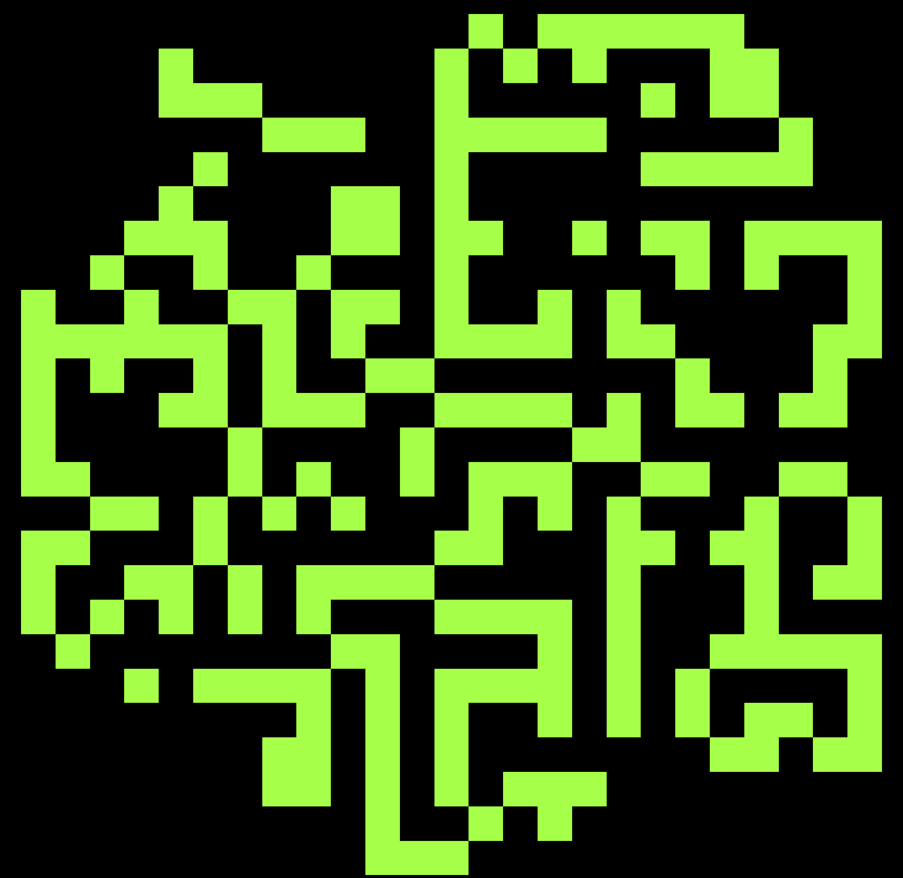

# Conway's Game of Life

My personal implementation of Conway's Game of Life.

All the logic is made by Go whilst the visaul redendering is obtained with web technologies.

## Usage

How to build:

```bash
go build -o conway
```

To have a list of all flags run:

```bash
./conway -h
```

To start visualazing in your default browser run:

```bash
./conway
```

